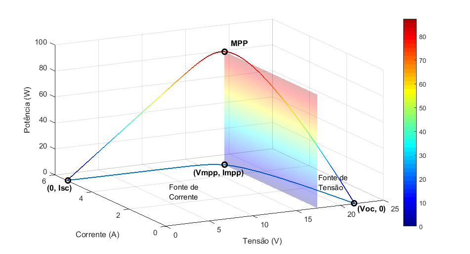

# Photovoltaic Cell Modeling

This code allows the user to simulate a photovoltaic cell behavior based on temperature, solar irradiation, and electrical circuit constraints.   

It's possible to obtain graphics for I-V (current versus voltage) and P-V (power versus voltage) curves. The code in general uses two basic approaches to obtain those graphics, with and without Lambdify function. Based on %timeit results it's clear that Labmdfy function optimizes the plotting process. 

